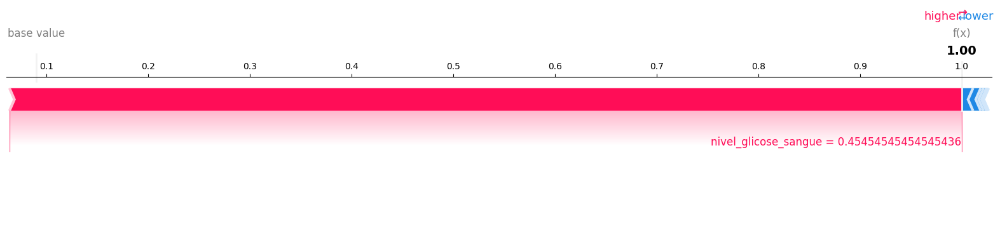
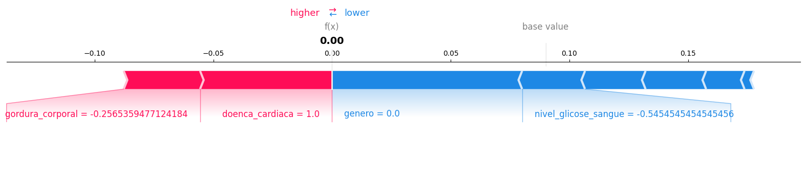
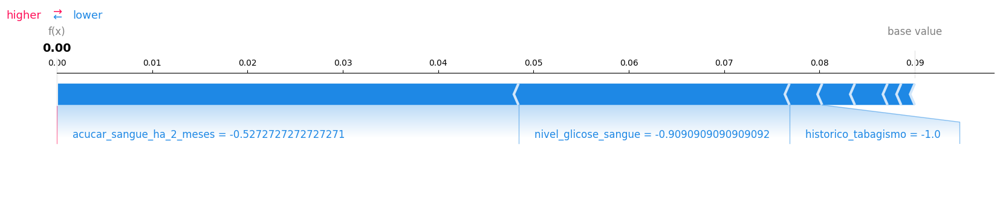
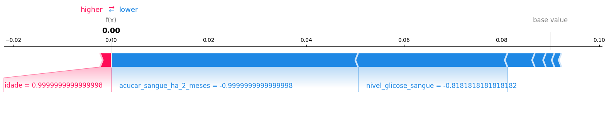

# Diabetes Prediction

- Este repositório representa outro estudo sobre shap values. Para ver a importância de cada feature tem quando o modelo dá o resultado.  

- Fonte dataset: [Kaggle](https://www.kaggle.com/datasets/iammustafatz/diabetes-prediction-dataset1)

- Fonte biblioteca: [SHAP](https://shap.readthedocs.io/en/latest/index.html)

- Explicação: [https://bixtecnologia.com.br/como-eu-gostaria-que-alguem-me-explicasse-shap-values/](https://bixtecnologia.com.br/como-eu-gostaria-que-alguem-me-explicasse-shap-values/)

---

- Explicação:  

---

- Resultados:  

  

Instância que provavelmente tinha um valor altíssimo de nível de glicose no sangue e o modelo previu positivo para diabetes.

---

  

Bem interessante este. Embora existam fortes evidências das features de gordura corporal e doenca cardíaca alta, o elemento em análise tem uma boa taxa de nível de glicose no sange (neste caso boa taxa pode-se dizer, baixíssima taxa). Assim, por mais que as duas features tivessem taxas ruins, a feature nível de glicose fez com que o modelo predizesse que esse indivíduo não tem diabetes.  

---

  

Caso bom e fácil. Indivíduo sem histórico de tabagismo, ótimo nível de glicose no sangue e sem açúcar no sangue nos últimos 2 meses. Esses fatores levaram o modelo a prever, fortemente, que o indivíduo não tem diabetes.

---

  

Outro caso muito bom. Provavelmente um indivíduo de elevada idade, levando o modelo a crer que pode ter diabetes. Porém o indivíduo possui ótimas taxas de glicose e açúcar no sangue, tornando a predição a não diabetes para este indivíduo.