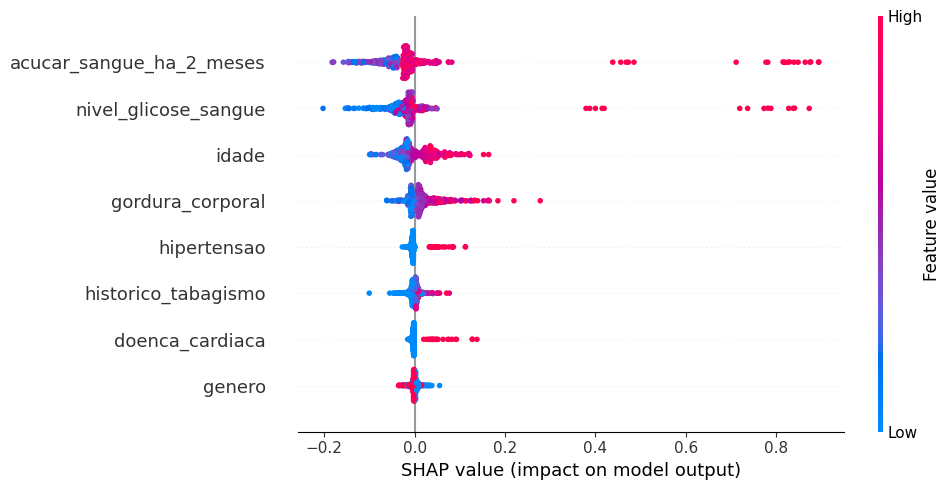
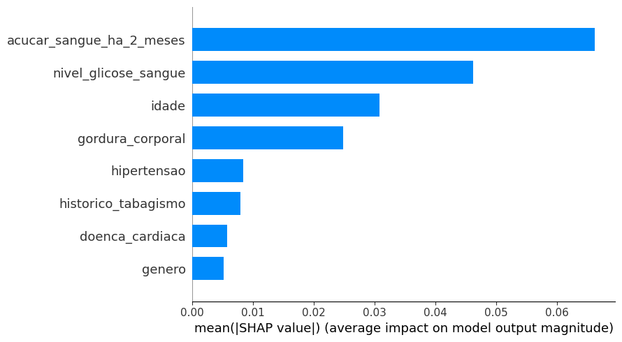
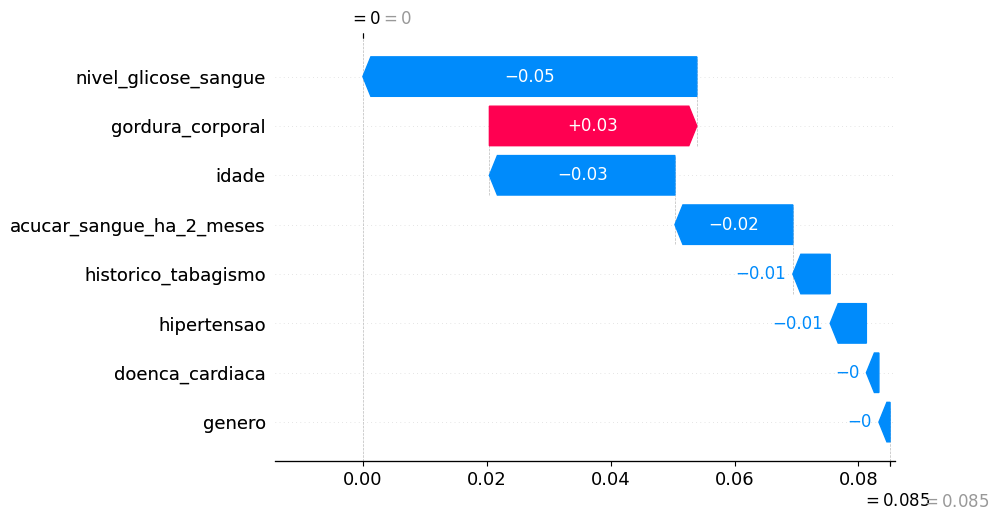
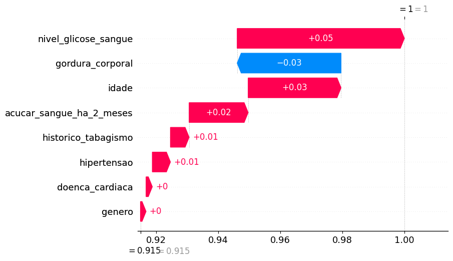

# Diabetes Prediction

- Este repositório representa outro estudo sobre shap values. Para ver a importância de cada feature tem quando o modelo dá o resultado.  

- Fonte dataset: [Kaggle](https://www.kaggle.com/datasets/iammustafatz/diabetes-prediction-dataset1)

- Fonte biblioteca: [SHAP](https://shap.readthedocs.io/en/latest/index.html)

- Explicação: [https://bixtecnologia.com.br/como-eu-gostaria-que-alguem-me-explicasse-shap-values/](https://bixtecnologia.com.br/como-eu-gostaria-que-alguem-me-explicasse-shap-values/)

---

- Explicação:  


---

- Resultados:  

  

Instância que provavelmente tinha um valor altíssimo de nível de glicose no sangue e o modelo previu positivo para diabetes.

---

  

Bem interessante este. Embora existam fortes evidências das features de gordura corporal e doenca cardíaca alta, o elemento em análise tem uma boa taxa de nível de glicose no sange (neste caso boa taxa pode-se dizer, baixíssima taxa). Assim, por mais que as duas features tivessem taxas ruins, a feature nível de glicose fez com que o modelo predizesse que esse indivíduo não tem diabetes.  

---

  

Caso bom e fácil. Indivíduo sem histórico de tabagismo, ótimo nível de glicose no sangue e sem açúcar no sangue nos últimos 2 meses. Esses fatores levaram o modelo a prever, fortemente, que o indivíduo não tem diabetes.

---

  

Outro caso muito bom. Provavelmente um indivíduo de elevada idade, levando o modelo a crer que pode ter diabetes. Porém o indivíduo possui ótimas taxas de glicose e açúcar no sangue, tornando a predição a não diabetes para este indivíduo.

---



```
# Gráfico 1 - Contribução das variáveis
shap.summary_plot(
    shap_values_train[1], # <<<<< aqui estamos pegando o resultado da classe 1 (diabetes)
    x_train, 
    plot_type="dot", 
    plot_size=(10, 5), 
    feature_names=FEATURE_NAMES,
    title="SHAP - Contribuição das variáveis para o modelo de Random Forest",
)
```

Quando estamos olhando a classe 1 (Diabetes), percebemos no gráfico que as features açúcar no sangue há 2 meses e nível alto de glicose são essenciais para dar suporte ao modelo a dizer que o indivíduo tem diabetes.  

Interessante perceber também que a feature "genero" é uma nuvem bem densa, difícil de saber se dá suporte ou não para classificar se o indivíduo tem diabetes.  

Perceba que esse gráfico está monitorando o comportamento do modelo com relação a todas as instâncias. Existem outros gráficos que podemos ver instância uma por uma.

---

```
shap.summary_plot(shap_values_train[1], x_train, plot_type="bar", plot_size=(9, 5), feature_names=df.columns[:-1])
```

  

Outro gráfico interessante. Também avalia o comportamento do modelo em relação a todas as intâncias e percebe-se que mostra o mesmo resultado do gráfico de nuvens de ponto. Só que aqui mostra o "peso" que cada feature tem para prever se um indivíduo pode ter diabetes ou não.

---

```
shap.plots._waterfall.waterfall_legacy(
    expected_value = explainer.expected_value[1], 
    shap_values = shap_values_train[1][3].reshape(-1), 
    feature_names = FEATURE_NAMES,
)
```
  

Um dos gráficos mais interessantes. Você define o ```expected_value```, ou seja, o quanto as features contribuem para chegar na decisão que o modelo tomou a partir do valor esperado. Funciona assim:  

- ```expected_value = explainer.expected_value[1]```: esse valor é um escalar. Neste dataset que estamos vendo, que tem classificação binária (diabetes=1 ou não diabetes=0), o valor esperado para quem tem diabetes é 0.08 e seu complemento, não diabetes = 0.92. Esses valores são aproximadamente o valor de amostras de instâncias com diabetes e não diabetes.  
- ```shap_values = shap_values_train[1][3].reshape(-1)```: escolhemos dentro array shap_values_train as análises da mesma classe que escolhemos no expected_value [1] e selecionei aleatoriamente o valor 3, ou seja, queremos ver o resultado da instância 3. 
- O gráfico nos diz que, a partir do valor base =1 (dessa instância ter diabetes), o nível de glicose, a idade e nível de açúcar no sangue contribuira para "dizer" que a chance dessa instância ter diabetes é zero, mesmo o índice de gorgura corporal tentando levar para uma conclusão contrária. 

- O mais interessante é que se mudarmos a pesperctiva, ou seja, de ver as contribuições individuais das features nessa instância a partir de **não ter diabetes**, chegamos ao seguinte gráfico: 
```
shap.plots._waterfall.waterfall_legacy(
    expected_value = explainer.expected_value[0], ## << não ter diabetes
    shap_values = shap_values_train[0][3].reshape(-1), 
    feature_names = FEATURE_NAMES,
)
```

  

Ou seja, o valor base de **não ter diabetes** é 0.92 e, neste caso, as mesmas features contribuiram para o modelo ter 100% de certeza que a instância [3] **não tem diabetes** (assim como concluiu que tem 0% de chances de ter diabetes). 